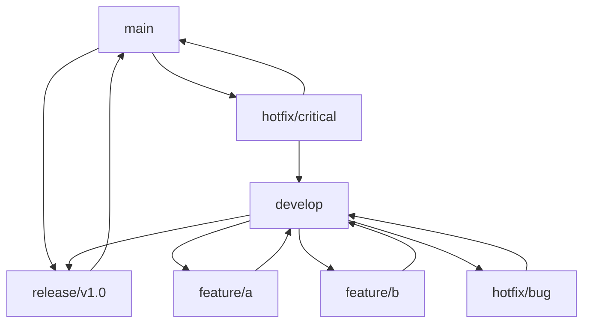
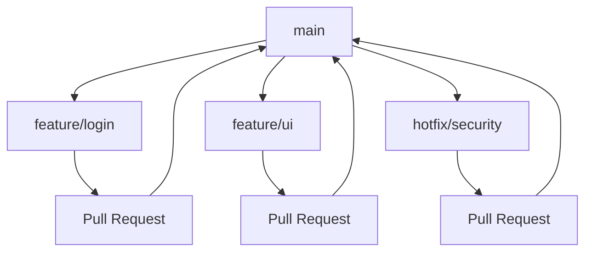
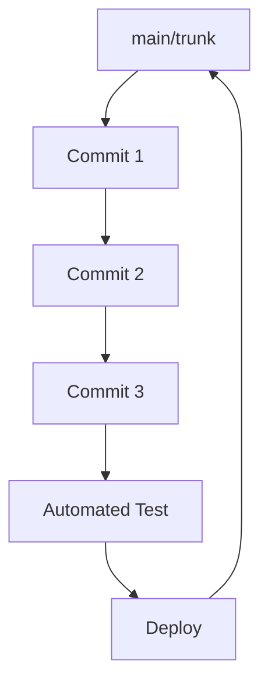

# Popular Branching Models

This guide compares Git Flow, GitHub Flow, and Trunk-Based Development with pros/cons and visual diagrams.

## Git Flow

A comprehensive branching model for release management.

### Structure
```
main (production)
├── release/v1.0
├── develop
│   ├── feature/feature-a
│   ├── feature/feature-b
│   └── hotfix/bug-fix
└── hotfix/critical-fix
```

### Workflow
1. `develop` is the main development branch
2. Create `feature/` branches from `develop`
3. Merge features back to `develop`
4. Create `release/` branches for releases
5. Merge releases to `main` and `develop`
6. Create `hotfix/` branches from `main` for critical fixes

### Pros
- Clear separation of environments
- Supports multiple versions
- Structured release process
- Good for complex projects

### Cons
- Complex workflow
- Many branches to manage
- Slow release cycles
- Overkill for small teams

## GitHub Flow

A simplified model focused on continuous deployment.

### Structure
```
main (production)
├── feature/add-login
├── feature/improve-ui
└── hotfix/security-patch
```

### Workflow
1. `main` is always deployable
2. Create feature branches from `main`
3. Open pull requests for code review
4. Merge to `main` after approval
5. Deploy immediately

### Pros
- Simple and fast
- Continuous deployment
- Good for web applications
- Easy to understand

### Cons
- No version management
- Risky for critical applications
- No staging environment
- Requires high test coverage

## Trunk-Based Development

All developers work on a single branch with frequent commits.

### Structure
```
main (trunk)
├── Short-lived feature branches (optional)
└── Frequent commits
```

### Workflow
1. All development happens on `main`
2. Use feature flags for incomplete features
3. Commit frequently (multiple times per day)
4. Automated testing and deployment
5. Pair programming encouraged

### Pros
- Fast feedback
- Reduced merge conflicts
- Continuous integration
- Good for microservices

### Cons
- Requires mature CI/CD
- High discipline required
- Not suitable for long features
- Risk of breaking main

## Comparison Table

| Aspect | Git Flow | GitHub Flow | Trunk-Based |
|--------|----------|-------------|-------------|
| Complexity | High | Low | Medium |
| Release Frequency | Monthly/Quarterly | Daily/Weekly | Continuous |
| Branch Lifetime | Long | Short | Very Short |
| Testing Required | Moderate | High | Very High |
| Team Size | Large | Small-Medium | Any |
| Deployment | Manual | Automated | Automated |

## Visual Diagrams

### Git Flow Diagram


### GitHub Flow Diagram


### Trunk-Based Development Diagram


## Choosing the Right Model

### Use Git Flow if:
- You have complex release processes
- You maintain multiple versions
- You have large, distributed teams
- You need strict environment separation

### Use GitHub Flow if:
- You practice continuous deployment
- You have web applications
- You want simple workflows
- You have good automated testing

### Use Trunk-Based Development if:
- You want maximum development speed
- You have mature DevOps practices
- You work in small, disciplined teams
- You use feature flags extensively

## Implementation Tips

1. **Start Simple**: Begin with GitHub Flow and evolve as needed
2. **Automate Everything**: Use CI/CD pipelines for all models
3. **Document Processes**: Clearly document your chosen workflow
4. **Train Team Members**: Ensure everyone understands the process
5. **Monitor and Adapt**: Regularly review and improve your branching strategy