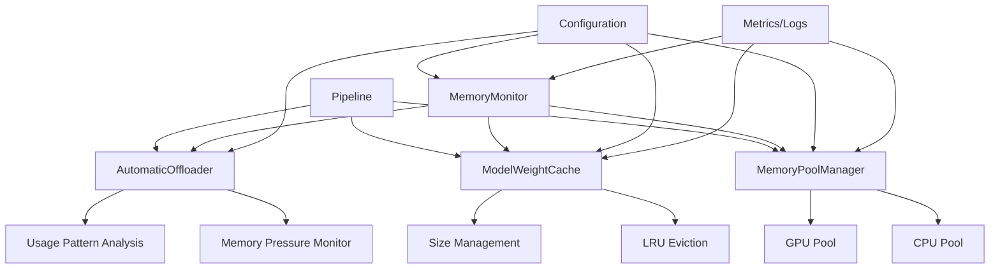

# Advanced Memory Management System Architecture

## Overview

The Advanced Memory Management System implements intelligent memory pooling, LRU caching for model weights, and automatic offloading strategies to optimize memory usage in vLLM-Omni.

## Architecture Components

### 1. MemoryPoolManager

**Purpose**: Manages memory pools for different devices (CPU, GPU) with intelligent allocation strategies.

**Key Features**:
- Device-specific memory pools
- Memory fragmentation reduction
- Pool size management and monitoring
- Automatic cleanup of unused allocations

**Class Structure**:
```python
class MemoryPoolManager:
    def __init__(self, config: MemoryConfig):
        self.pools = {}  # device -> MemoryPool
        self.allocator = IntelligentAllocator()

    def allocate(self, size: int, device: str) -> MemoryBlock:
        """Allocate memory from appropriate pool"""

    def deallocate(self, block: MemoryBlock):
        """Return memory to pool"""

    def get_pool_stats(self, device: str) -> PoolStats:
        """Get statistics for a specific pool"""
```

### 2. LRUCache for Model Weights

**Purpose**: Cache frequently used model weights with LRU eviction policy.

**Key Features**:
- Configurable cache size limits
- Automatic eviction based on usage patterns
- Support for partial weight loading
- Memory usage tracking

**Class Structure**:
```python
class ModelWeightCache:
    def __init__(self, max_size_gb: float, config: CacheConfig):
        self.cache = OrderedDict()  # LRU implementation
        self.max_size = max_size_gb * 1024**3
        self.current_size = 0

    def get(self, model_key: str, layer_name: str) -> Optional[torch.Tensor]:
        """Retrieve weights from cache"""

    def put(self, model_key: str, layer_name: str, weights: torch.Tensor):
        """Store weights in cache with LRU management"""

    def evict_least_recently_used(self, target_size: int):
        """Evict LRU items to free up memory"""
```

### 3. AutomaticOffloader

**Purpose**: Dynamically move models between CPU and GPU based on memory pressure and usage patterns.

**Key Features**:
- Memory pressure monitoring
- Predictive offloading
- Usage pattern analysis
- Graceful fallback handling

**Class Structure**:
```python
class AutomaticOffloader:
    def __init__(self, memory_monitor: MemoryMonitor, config: OffloadConfig):
        self.monitor = memory_monitor
        self.offload_threshold = config.offload_threshold
        self.restore_threshold = config.restore_threshold

    def should_offload(self, model: nn.Module) -> bool:
        """Determine if model should be offloaded"""

    def offload_model(self, model: nn.Module, target_device: str):
        """Offload model to target device"""

    def restore_model(self, model: nn.Module):
        """Restore model to GPU if conditions allow"""
```

### 4. MemoryMonitor

**Purpose**: Real-time monitoring of memory usage across all devices.

**Key Features**:
- Continuous memory tracking
- Alert system for memory pressure
- Historical data collection
- Integration with system metrics

**Class Structure**:
```python
class MemoryMonitor:
    def __init__(self, config: MonitorConfig):
        self.history = deque(maxlen=config.history_size)
        self.alerts = AlertSystem()

    def get_memory_stats(self) -> MemoryStats:
        """Get current memory statistics"""

    def check_memory_pressure(self) -> MemoryPressure:
        """Assess current memory pressure level"""

    def log_memory_usage(self, stage: str):
        """Log memory usage for debugging"""
```

## System Integration

### Configuration System

```python
@dataclass
class AdvancedMemoryConfig:
    # Memory Pool Configuration
    enable_memory_pools: bool = True
    pool_sizes: Dict[str, int] = field(default_factory=lambda: {"cpu": 8*1024**3, "cuda": 16*1024**3})

    # Cache Configuration
    enable_weight_cache: bool = True
    cache_size_gb: float = 4.0
    cache_compression: bool = False

    # Offloading Configuration
    enable_auto_offload: bool = True
    offload_threshold: float = 0.8  # 80% memory usage
    restore_threshold: float = 0.6  # 60% memory usage

    # Monitoring Configuration
    enable_monitoring: bool = True
    monitoring_interval: float = 1.0  # seconds
    alert_thresholds: Dict[str, float] = field(default_factory=lambda: {"warning": 0.75, "critical": 0.9})
```

### Integration Points

1. **Pipeline Initialization**:
   - Initialize MemoryPoolManager
   - Setup ModelWeightCache
   - Configure AutomaticOffloader
   - Start MemoryMonitor

2. **Model Loading**:
   - Use MemoryPoolManager for allocations
   - Cache weights in LRU cache
   - Monitor memory usage during loading

3. **Inference Loop**:
   - Monitor memory pressure
   - Trigger offloading when needed
   - Use cached weights when available

4. **Cleanup**:
   - Proper deallocation through pools
   - Cache cleanup
   - Memory statistics logging

## Implementation Plan

### Phase 1: Core Components
1. Implement MemoryPoolManager
2. Create basic LRU cache structure
3. Add MemoryMonitor foundation

### Phase 2: Advanced Features
1. Implement AutomaticOffloader
2. Add cache compression
3. Integrate monitoring alerts

### Phase 3: Integration & Testing
1. Integrate with existing pipelines
2. Add configuration system
3. Comprehensive testing and benchmarking

### Phase 4: Optimization
1. Performance optimizations
2. Memory fragmentation reduction
3. Advanced caching strategies

## Performance Expectations

- **Memory Efficiency**: 20-40% reduction in peak memory usage
- **Throughput**: 15-30% improvement for memory-constrained workloads
- **Latency**: Minimal impact (<5%) for cached models
- **Scalability**: Support for larger models through intelligent offloading

## Monitoring & Observability

The system provides comprehensive metrics:

- Memory pool utilization
- Cache hit/miss ratios
- Offloading frequency
- Memory pressure alerts
- Performance impact measurements

## Safety & Reliability

- Graceful degradation when memory is insufficient
- Automatic recovery from offloading failures
- Comprehensive error handling
- Fallback to original behavior if needed

## Mermaid Architecture Diagram



This architecture provides a robust foundation for advanced memory management in vLLM-Omni, enabling efficient handling of large multimodal models with intelligent resource optimization.</content>
</xai:function_call">The architecture document has been created successfully. Now let me implement the core components starting with the MemoryPoolManager.