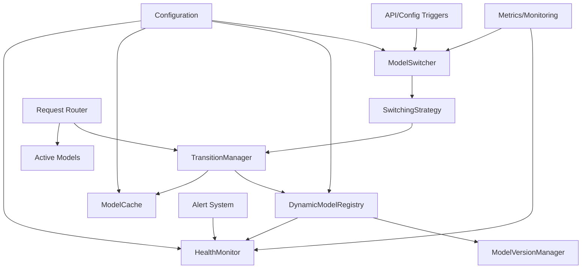

# Real-time Model Switching Architecture

## Overview

The Real-time Model Switching system enables hot-swapping between different model variants without service interruption, supporting A/B testing, gradual rollouts, dynamic model selection based on input characteristics, and emergency rollbacks.

## Architecture Components

### 1. DynamicModelRegistry

**Purpose**: Extends the static model registry to support runtime registration, deregistration, and management of multiple model versions.

**Key Features**:
- Runtime model registration/deregistration
- Version tracking and metadata storage
- Model health status monitoring
- Automatic cleanup of unused models

**Class Structure**:
```python
class DynamicModelRegistry:
    def __init__(self, base_registry: OmniModelRegistry):
        self.base_registry = base_registry
        self.active_models = {}  # model_id -> ModelInstance
        self.model_versions = {}  # model_id -> List[ModelVersion]
        self.health_monitor = ModelHealthMonitor()

    def register_model(self, model_config: ModelConfig, version: str) -> str:
        """Register a new model version"""

    def deregister_model(self, model_id: str, version: str):
        """Remove a model version"""

    def get_active_model(self, model_id: str) -> ModelInstance:
        """Get currently active model for given ID"""

    def switch_model(self, model_id: str, target_version: str) -> bool:
        """Switch active model to target version"""
```

### 2. ModelVersionManager

**Purpose**: Manages model versions, metadata, and provides rollback capabilities.

**Key Features**:
- Version history tracking
- Metadata storage (performance metrics, creation date, etc.)
- Rollback support
- Version comparison and validation

**Class Structure**:
```python
class ModelVersionManager:
    def __init__(self, storage_backend: VersionStorage):
        self.storage = storage_backend
        self.version_history = {}  # model_id -> VersionHistory

    def create_version(self, model_id: str, model_config: ModelConfig,
                      metadata: Dict[str, Any]) -> ModelVersion:
        """Create a new model version"""

    def get_version(self, model_id: str, version: str) -> ModelVersion:
        """Retrieve model version information"""

    def rollback_to_version(self, model_id: str, version: str) -> bool:
        """Rollback to specified version"""

    def compare_versions(self, model_id: str, version1: str, version2: str) -> VersionComparison:
        """Compare two model versions"""
```

### 3. ModelSwitcher

**Purpose**: Orchestrates the model switching process with different strategies.

**Key Features**:
- Multiple switching strategies (immediate, gradual, canary)
- Traffic distribution control
- Switching progress tracking
- Rollback on failure

**Class Structure**:
```python
class ModelSwitcher:
    def __init__(self, registry: DynamicModelRegistry, strategy: SwitchingStrategy):
        self.registry = registry
        self.strategy = strategy
        self.switch_progress = {}  # model_id -> SwitchProgress

    def switch_model(self, model_id: str, target_version: str,
                    strategy_config: Dict[str, Any]) -> SwitchOperation:
        """Initiate model switch with specified strategy"""

    def get_switch_status(self, operation_id: str) -> SwitchStatus:
        """Get status of ongoing switch operation"""

    def abort_switch(self, operation_id: str):
        """Abort ongoing switch operation"""
```

### 4. TransitionManager

**Purpose**: Ensures seamless transitions during model switching with zero downtime.

**Key Features**:
- In-flight request tracking
- Graceful request completion
- Traffic redirection
- Failure recovery

**Class Structure**:
```python
class TransitionManager:
    def __init__(self, request_tracker: RequestTracker):
        self.request_tracker = request_tracker
        self.active_transitions = {}  # transition_id -> TransitionState

    def begin_transition(self, from_model: ModelInstance, to_model: ModelInstance) -> str:
        """Begin transition from one model to another"""

    def handle_request_routing(self, request: InferenceRequest) -> ModelInstance:
        """Route request to appropriate model during transition"""

    def complete_transition(self, transition_id: str):
        """Complete the transition process"""

    def rollback_transition(self, transition_id: str):
        """Rollback transition on failure"""
```

### 5. ModelCache

**Purpose**: Caches loaded models to enable fast switching between frequently used variants.

**Key Features**:
- LRU eviction policy
- Memory-aware caching
- Pre-loading capabilities
- Cache warming strategies

**Class Structure**:
```python
class ModelCache:
    def __init__(self, max_cache_size: int, memory_manager: MemoryManager):
        self.cache = OrderedDict()  # LRU implementation
        self.max_size = max_cache_size
        self.memory_manager = memory_manager

    def get_model(self, model_key: str) -> Optional[ModelInstance]:
        """Retrieve model from cache"""

    def put_model(self, model_key: str, model: ModelInstance):
        """Store model in cache"""

    def preload_model(self, model_key: str, priority: int):
        """Pre-load model into cache"""

    def evict_model(self, model_key: str):
        """Remove model from cache"""
```

### 6. SwitchingStrategy

**Purpose**: Defines different strategies for model switching.

**Key Features**:
- Immediate switching
- Gradual rollout (percentage-based)
- Canary deployments
- A/B testing with traffic splitting

**Class Structure**:
```python
class SwitchingStrategy(ABC):
    @abstractmethod
    def execute_switch(self, switcher: ModelSwitcher, operation: SwitchOperation) -> bool:
        """Execute the switching strategy"""

class ImmediateSwitch(SwitchingStrategy):
    """Immediate switch to new model"""

class GradualRollout(SwitchingStrategy):
    """Gradual rollout with percentage control"""

class ABTestSwitch(SwitchingStrategy):
    """A/B testing with traffic splitting"""

class CanarySwitch(SwitchingStrategy):
    """Canary deployment strategy"""
```

### 7. HealthMonitor

**Purpose**: Monitors model health and performance during and after switching.

**Key Features**:
- Performance metrics collection
- Error rate monitoring
- Latency tracking
- Automatic alerting

**Class Structure**:
```python
class HealthMonitor:
    def __init__(self, alert_system: AlertSystem):
        self.metrics_collector = MetricsCollector()
        self.alert_system = alert_system
        self.health_checks = {}  # model_id -> HealthStatus

    def check_model_health(self, model: ModelInstance) -> HealthStatus:
        """Check health of a model instance"""

    def monitor_switch_impact(self, switch_operation: SwitchOperation):
        """Monitor impact of model switch"""

    def trigger_alert(self, alert_type: str, details: Dict[str, Any]):
        """Trigger alert for health issues"""
```

## System Integration

### Configuration System

```python
@dataclass
class ModelSwitchingConfig:
    # Registry Configuration
    enable_dynamic_registry: bool = True
    max_cached_models: int = 5
    model_ttl_seconds: int = 3600

    # Switching Configuration
    default_switch_strategy: str = "immediate"
    enable_health_checks: bool = True
    health_check_interval: float = 30.0

    # Transition Configuration
    max_transition_time: float = 300.0  # 5 minutes
    enable_request_tracking: bool = True

    # Monitoring Configuration
    enable_metrics: bool = True
    metrics_interval: float = 60.0
    alert_thresholds: Dict[str, float] = field(default_factory=lambda: {
        "error_rate": 0.05,
        "latency_p95": 5000.0
    })
```

### Integration Points

1. **Engine Initialization**:
   - Initialize DynamicModelRegistry
   - Setup ModelCache and ModelVersionManager
   - Configure HealthMonitor

2. **Request Processing**:
   - Route requests through TransitionManager
   - Use active model from registry
   - Track request completion

3. **Model Management**:
   - Register new models via API or config
   - Switch models using configured strategies
   - Monitor health and performance

4. **Monitoring & Observability**:
   - Collect metrics on switching operations
   - Monitor model health and performance
   - Alert on issues

## Implementation Plan

### Phase 1: Core Infrastructure
1. Implement DynamicModelRegistry
2. Create ModelVersionManager
3. Add basic ModelCache functionality

### Phase 2: Switching Logic
1. Implement TransitionManager
2. Add SwitchingStrategy classes
3. Create ModelSwitcher orchestrator

### Phase 3: Advanced Features
1. Implement HealthMonitor
2. Add API endpoints for management
3. Integrate with configuration system

### Phase 4: Integration & Testing
1. Integrate with existing engine
2. Add comprehensive testing
3. Performance optimization and benchmarking

## Performance Expectations

- **Switching Time**: <30 seconds for immediate switches
- **Memory Overhead**: <10% for cached models
- **Zero Downtime**: Guaranteed for all switching operations
- **Request Latency**: <5% impact during transitions

## Safety & Reliability

- Graceful handling of model loading failures
- Automatic rollback on health check failures
- Comprehensive error handling and logging
- Fallback to last known good model

## Mermaid Architecture Diagram



This architecture provides a robust foundation for real-time model switching in vLLM-Omni, enabling seamless transitions between model variants while maintaining service availability and performance.</content>
